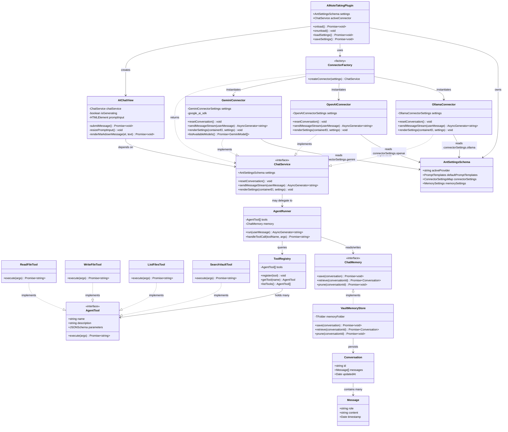

# ai-obsidian-plugion

A small Obsidian plugin that provides AI-assisted note-taking features (summaries, prompts, completions) directly inside the vault.

## Features
- Generate summaries for a note or selection
- Create suggested titles and tags
- Insert AI-composed content via command palette
- Configurable model, max tokens, and temperature
- Simple keyboard shortcuts and command palette integration

## Prerequisites
- Obsidian (v1.0+)
- Node.js & npm (for development)
- Valid AI API key configured in plugin settings

## Installation
1. Drop the built plugin folder into:
`.obsidian/plugins/ai-obsidian-plugion`
2. Open Obsidian → Settings → Community plugins → Enable `ai-obsidian-plugion`.
3. Open plugin settings to add your API key and tune options.

## Usage
- Command palette: “AI: Summarize note”, “AI: Suggest title”, “AI: Generate content”
- Select text and run “AI: Summarize selection” to get a brief summary inserted as a block.
- Configure default prompt templates in Settings.

## Settings (examples)
- API Key: your provider key
- Model: gpt-like-model
- Max tokens: 512
- Temperature: 0.2
- Default prompt templates: summary, expand, title-suggest

## Troubleshooting
- No response: check API key and network connectivity.
- Rate limit errors: reduce request frequency or tokens.
- Permission issues: ensure plugin folder and files are readable by Obsidian.

## TODO / Roadmap

### Architecture refactor
- [ ] Restructure `src/` into `connectors/`, `agent/`, `memory/`, and `prompts/` folders
- [ ] Rename `interface-chat-service.ts` → `connectors/connector.interface.ts`
- [ ] Move `gemini-chat-services.ts` → `connectors/gemini/gemini-connector.ts`
- [ ] Add `connectors/index.ts` factory to select provider from settings

### Connectors
- [ ] Support multiple AI providers implementing the shared `ChatService` interface (OpenAI, Anthropic, local/Ollama)
- [ ] Auto-fetch available models per provider instead of hardcoding a static enum
- [ ] Cache model list with TTL to avoid excessive `ListModels` calls
- [ ] Graceful fallback when a model 404s (e.g. try next model in list)

### Agent / tool-calling
- [ ] Define `AgentTool` interface (name, description, parameters, execute)
- [ ] Implement file read tool (agent reads notes from the vault)
- [ ] Implement file write tool (agent creates/edits notes in the vault)
- [ ] Implement list-files / vault search tool
- [ ] Add safety gating (confirmation step or settings toggle) for write-capable tools
- [ ] Decide: tool-calling loop lives in a shared `agent-runner.ts`, or per-connector

### Chat memory
- [ ] Define `ChatMemory` interface (save, retrieve, prune/summarize)
- [ ] Decide storage strategy: vault notes (user-visible) vs. plugin data (`data.json`)
- [ ] Implement conversation summarization for long chat histories
- [ ] Add memory retrieval into chat context on new messages

### Settings refactor
- [ ] Replace flat settings shape with per-connector settings map (`connectorSettings: { gemini?, openai?, anthropic?, ollama? }`)
- [ ] Keep only provider-agnostic settings at the top level (`activeProvider`, prompt templates, memory config, UI preferences)
- [ ] Add `renderSettings(containerEl, settings)` to the `ChatService` interface so each connector owns its own settings UI section
- [ ] Write one-time migration in `loadSettings()` to move existing flat `apiKey`/`model`/`temperature` fields into `connectorSettings.gemini`
- [ ] Validate settings per-connector (e.g. Ollama needs `baseUrl`, not `apiKey`)

### Code quality / tooling
- [ ] Resolve remaining ESLint issues (sentence-case UI strings, floating promises, static style assignment)

# Architecture overview

Class diagram of the planned plugin architecture: connectors, agent tools, memory, and how the main plugin and chat view wire them together.

## Notes

- **`ChatService`** is the core contract every connector implements. `AIChatView` only ever talks to this interface, never a concrete connector — swapping providers means swapping what `ConnectorFactory` returns.
- **`AgentRunner`** sits between a connector and the tool/memory layers. Whether it's invoked *inside* each connector (provider-specific function-calling format) or wraps connectors generically is still an open decision from the roadmap — this diagram assumes the generic-wrapper approach.
- **`ChatMemory`** is intentionally decoupled from `ChatService` — memory persistence shouldn't care which provider generated the messages.
- **`VaultMemoryStore`** is one possible `ChatMemory` implementation (storing conversations as vault notes); a `data.json`-backed implementation could be swapped in without touching `AgentRunner` or `AIChatView`.